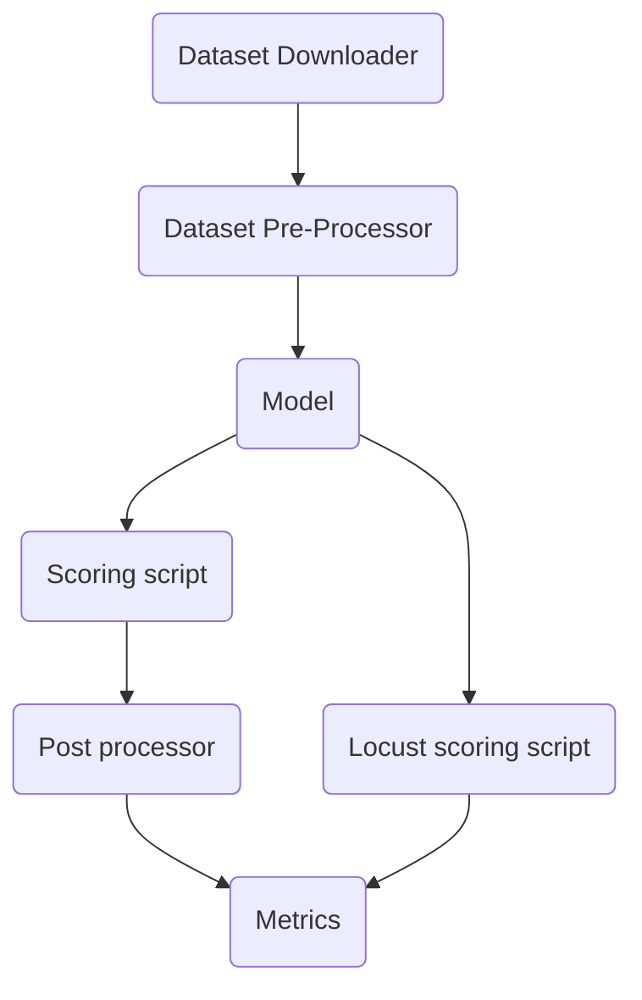

# Dhruva Evaluation Suite

## Functional Testing

<br>

```python
# ASR
eval = AccuracyEvaluator(
    {
        "plugins": [
            "MUCSHindiDataset",     # Dataset downloader
            "MUCSPreProcessor",     # Dataset preprocessor. Dumps into a JSONL file
            "ASRBatchE2EModel",     # Model
            "ASRBatchE2EScorer",    # Scoring script for the model
            "WERMetric"             # Metric to evaluate
        ]
    }
)

eval.eval()
```  
  
<br>

---

<br>

## Load Testing - Locust

Locust evaluator plugin calls the model with standard data and simlautes user load


```python
# ASR
eval = AccuracyEvaluator(
    {
        "plugins": [
            "MUCSHindiDataset",     # Dataset downloader
            "MUCSPreProcessor",     # Dataset preprocessor. Dumps into a JSONL file
            "ASRBatchE2EModel",     # Model
            "LocustScorer"          # Scaled scoring script
        ]
    }
)

eval.eval()
```
<br>

---

<br>

## Architecture


<br>

---

<br>

## Contribute Plugins
Plugins are organised as folders and files
- Add in a config for the respective plugin
- Subclass PluginBase and / or task specific base classes and override the get_inputs and invoke methods
